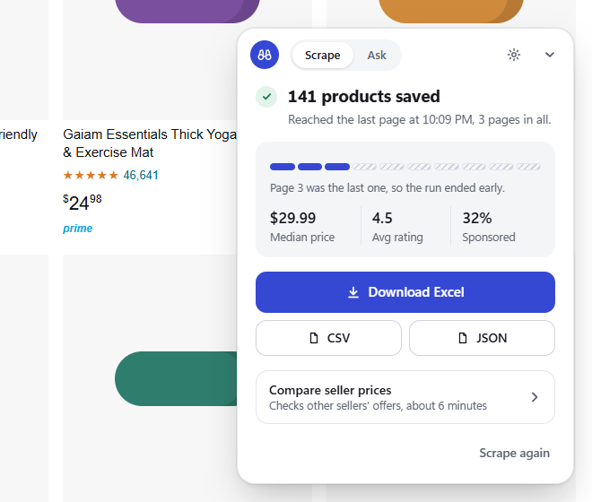
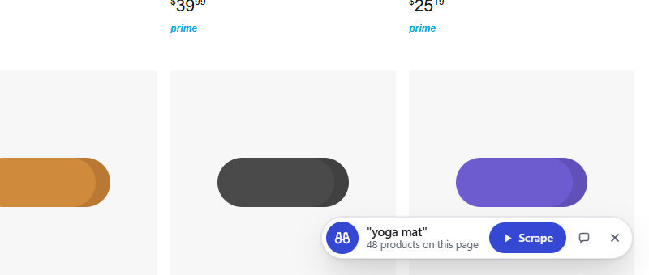
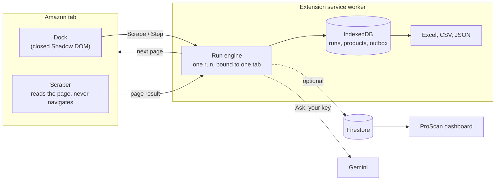

<h1 align="center">ProScan</h1>

<p align="center"><b>Scrape any Amazon search or seller storefront in one click.</b><br>
A small dock in the corner of the page turns every results page for you and hands back an Excel file.</p>

<p align="center">
  <br>
  <a href="https://chromewebstore.google.com/detail/proscan-amazon-product-sc/bikgignfnljpbmchlemkbbpboigodgap"><b>Get it on the Chrome Web Store</b></a>
</p>

## How it works



1. **Open.** Go to an Amazon search or a seller's storefront. The dock in the bottom-right corner offers **Scrape**. There is nothing to pin or open, and no account to make.
2. **Scrape.** ProScan reads every product on the page (title, ASIN, price, rating, reviews, Prime, sponsored), then opens the next page itself, 2 to 4 seconds apart, until the last page or your page limit. **Stop** keeps what it has.
3. **Download.** When the run ends the dock says why (last page, stopped, or Amazon showed a captcha) and offers Excel, CSV or JSON.
4. **Ask.** The dock's second tab answers questions about the products you just scraped ("what's the best rated mat under $30?"), using Google Gemini and your own free API key.

Accounts are optional. Signing in only sends your scans to the [ProScan dashboard](https://proscanbot.web.app/dashboard/), where you can track prices across runs.

## System design

Everything happens in your browser. The only servers involved are Google's: Gemini if you use Ask, and Firebase if you sign in to the dashboard.



The service worker is the only thing that writes data or changes pages, so closing the popup, switching tabs or Chrome stopping the worker between pages does not lose a run. Full detail is in [docs/ARCHITECTURE.md](docs/ARCHITECTURE.md).

## Permissions

ProScan asks for `storage`, `downloads`, and access to amazon.com and the Gemini API. Nothing else. A check in CI (`npm run lock`) fails the build if anything is ever added, because every new permission makes Chrome ask existing users to approve the extension again.

## Run it

```bash
git clone https://github.com/EnesYilmazcode/AmazonSellerScraper.git
cd AmazonSellerScraper
npm ci
npm run build      # builds the extension into dist/
npm test           # unit tests, plus a corpus of saved Amazon pages
npm run test:e2e   # loads dist/ into Chromium and scrapes the saved pages, no live Amazon traffic
npm run check      # permission lock, version gate and secret scan
```

Then open `chrome://extensions`, turn on Developer mode, click **Load unpacked** and pick `dist/`. The repo root does not load on its own because the service worker is bundled. `npm run build:dev` points sync at the local Firebase emulators instead of the real project.

| Folder | What's in it |
|---|---|
| [`scripts/content/`](scripts/content/) | the dock, the page scraper, seller offer fetching |
| [`scripts/background/`](scripts/background/) | the run engine, IndexedDB, downloads, sync |
| [`scripts/lib/`](scripts/lib/) | pure parsers, the run state machine, page types, the Gemini request |
| [`popup/`](popup/) | the toolbar popup, a fallback for the dock |
| [`packages/schema/`](packages/schema/) | the cloud data shapes, shared with the dashboard |
| [`tests/`](tests/) | Jest suite, the saved page corpus, the Chromium harness |
| [`tools/`](tools/) | build, store zip, permission lock, secret scan |

## Known gaps

**Compare seller prices** misses most offers on Amazon's current pages and is being rebuilt. The opportunity score is a rough heuristic, `(rating * log10(reviews + 1)) / sqrt(price)`, not a forecast.

## Privacy

Scans stay on your computer unless you sign in, which sends them to your dashboard. Ask sends your question and the scanned products to Google Gemini with your own key. See the [privacy policy](https://proscanbot.web.app/privacy/).

## Credits

Built by [Enes Yilmaz](https://github.com/EnesYilmazcode). Excel files by [SheetJS](https://sheetjs.com).
